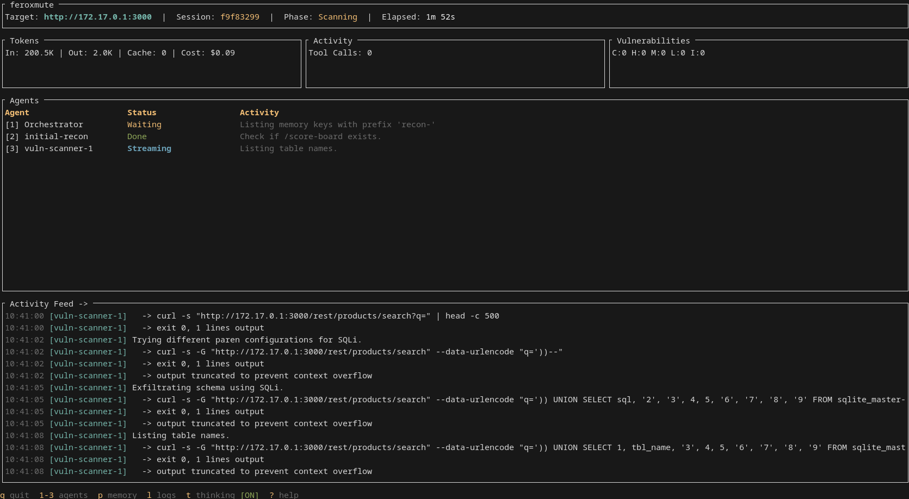

# feroxmute

LLM-powered penetration testing framework with autonomous agents.

> ⚠️ **Vibecoded and under heavy development.** Expect breaking changes, rough edges, and the occasional chaos.

feroxmute automates security testing using a hierarchy of specialized AI agents. An orchestrator plans the engagement and delegates to recon, scanner, exploit, and report agents - all executing tools inside a Kali Linux Docker container while you watch from a terminal UI.



## Features

- **Hierarchical agent architecture** - Orchestrator delegates to specialist agents (recon, scanner, exploit, report, script)
- **Multi-provider LLM support** - Anthropic, OpenAI, Gemini, Cohere, xAI, DeepSeek, Azure, Perplexity, Ollama, and LiteLLM (powered by [rig](https://github.com/0xPlaygrounds/rig)). Tested primarily with Gemini 3 Pro and Gemini 3 Flash.
- **Docker isolation** - All tools run inside a Kali Linux container
- **Terminal UI** - Live dashboard showing agent activity, tool output, and findings
- **Session persistence** - SQLite-backed state with resumable sessions
- **Agent memory** - Persistent scratchpad for orchestrator context (press `p` in TUI to view)
- **SAST support** - Link source code to web targets for combined analysis
- **Engagement controls** - Passive mode, port restrictions, rate limiting, scope limitations

## Quick Start

### Prerequisites

- Rust toolchain (1.75+)
- Docker running
- API key for your LLM provider (e.g., `ANTHROPIC_API_KEY`)

### Installation

```bash
git clone https://github.com/yourusername/feroxmute
cd feroxmute
cargo build --release
```

### Setup

```bash
# Interactive configuration wizard
./target/release/feroxmute --wizard
```

This creates `~/.feroxmute/config.toml` with your provider settings.

### Run

```bash
# Start an engagement (Kali container builds automatically on first run)
./target/release/feroxmute --target example.com
```

## Usage

```bash
feroxmute [OPTIONS] --target <TARGET>
```

| Flag | Description |
|------|-------------|
| `--target <URL>` | Target URL or IP |
| `--provider <NAME>` | LLM provider (anthropic, openai, gemini, ollama, etc.) |
| `--model <MODEL>` | Override default model |
| `--passive` | Passive reconnaissance only, no active scanning |
| `--sast-only` | Source code analysis only, no web testing |
| `--source <PATH>` | Link source code directory to target |
| `--discover` | Enable subdomain enumeration and asset discovery |
| `--portscan` | Enable port scanning (naabu, nmap) |
| `--network` | Enable network-level scanning beyond HTTP |
| `--no-exploit` | Disable exploitation phase |
| `--ports <LIST>` | Limit to specific ports (e.g., `80,443,8080`) |
| `--rate-limit <N>` | Max requests per second |
| `--instruction <TEXT>` | Custom objective for the orchestrator |
| `--resume <PATH>` | Resume a previous session |
| `--wizard` | Interactive setup |
| `-v`, `-vv`, `-vvv` | Increase verbosity |

### Examples

```bash
# Default: Test a web application thoroughly (no discovery, no portscan)
feroxmute --target https://app.example.com

# Enable subdomain discovery for broader coverage
feroxmute --target example.com --discover

# Full network penetration test
feroxmute --target 10.0.0.0/24 --discover --portscan --network

# Combine web target with source code analysis
feroxmute --target https://app.example.com --source ./src

# Source code analysis only
feroxmute --sast-only --target ./my-project
```

## Docker

The Kali container builds automatically on first run. For manual control:

```bash
# Build the Kali image
docker compose -f docker/compose.yml build

# Start containers
docker compose -f docker/compose.yml up

# Start with LiteLLM proxy sidecar
docker compose -f docker/compose.yml --profile litellm up
```

## Disclaimer

This tool is intended for **authorized security testing only**.

- Only use against systems you own or have explicit written permission to test
- You are solely responsible for your actions
- The authors accept no liability for misuse or damage caused by this software
- This software comes with **absolutely no warranty**

**Use at your own risk.**

## License

BSD 3-Clause License. See [LICENSE](LICENSE) for details.
